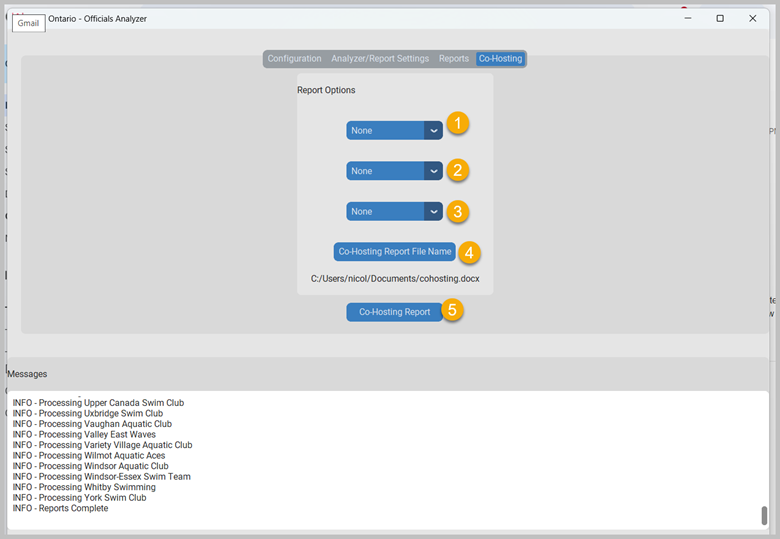

.. include:: common.rst
==========
Co-Hosting
==========

This feature can be used by ROA or POA where exports include multiple clubs or if a club has another club’s export (no modifications to file)

1.	Click on first None button and Select club 1
2.	Click on second None button and Select club 2
3.	If necessary click on third None button and Select club 3
4.	Click on Co-Hosting Report File Name to name the file for co-hosting
5.	Click on Co-Hosting Report button to generate the report

