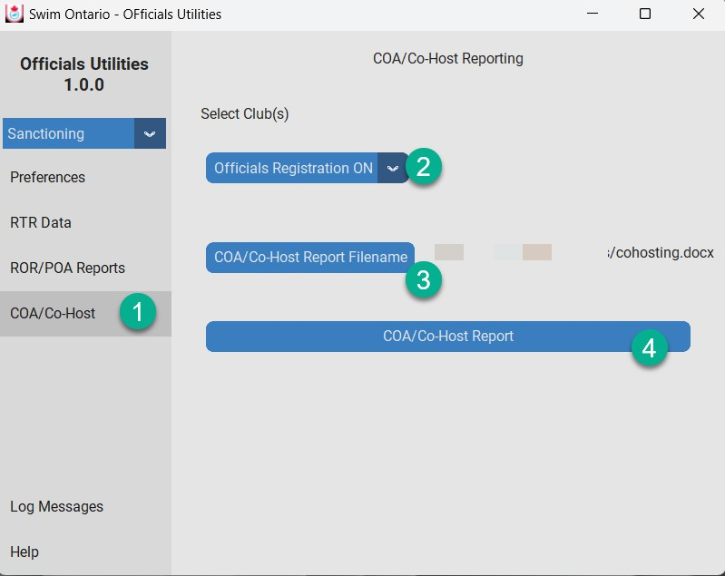

.. include:: common.rst
COA/Co-Hosting
==============

The COA/Co-Host Reporting options is for when you have a single club or for co-hosting multiple clubs. REMINDER: A club can add multiple exports from another club from the RTR Data Loading menu page.
If one club do the following:

1.   Click COA/Co-Host on left menu.
2.   Make sure the correct Club is selected.
3.   Click  COA/Co-Host Report Filename button to give the report file a name. The report file is a WORD document.
4.   Click  COA/Co-Host Report button.

If two or more clubs you can run a single club report or a Co-hosting report:

1.   Click COA/Co-Host on left menu.
2.   Select the clubs for Co-Hosting
3.   Click  COA/Co-Host Report Filename button to give the report file a name. The report file is a WORD document.
4.   Click  COA/Co-Host Report button.

Wait until the report is done.  A pop up Report complete (Click OK button)

