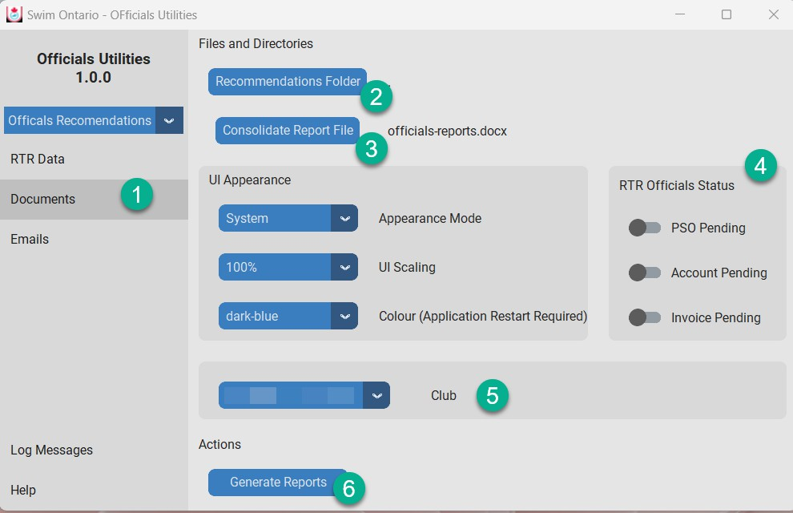
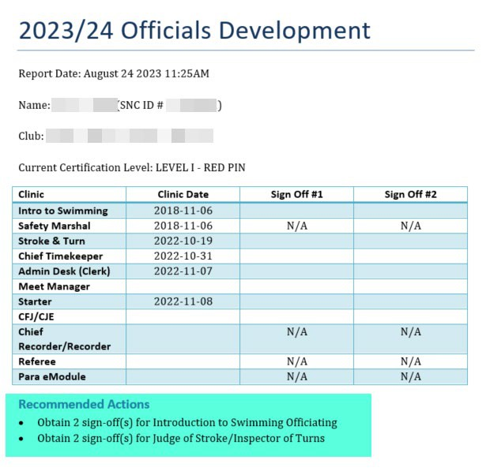

.. include:: common.rst

Documents
=========

The Documents page has all of the settings a COA/ROR would use to generate the Officials Recommendations.

Note: You can change the System Appearance here also.

1.   Click on Documents Menu (left frame).
2.   Click on Recommendations Folder button and select the folder you want all the documents to be stored on your computer.
3.   Click the Consolidated Report File button to name the file for all the reports.
4.   Select which RTR Officials Status to use.  Status “Active” is automatic.
5.   If more than one club in the export, you can select for which club to generate the report.  The report is for one club only.
6.   Click on Generate Reports button

What Documents are generated with the Officials Recommendations Utility

•   A single consolidated file with all officials up to Level II
    o The name you selected for the consolidated report

•   A separate WORD file for each official up to Level II with their Name as the file name
    o LastName-FirstName.docx

•   A CSV file containing the email address in the same folder as the other reports
    o docgen-email-list.csv
    o Don’t rename this file. It will be used in the emailing process.

The generated report details for Officials Recommendation Utilities

The report will provide a summary of clinics and deck sign-offs and a list of recommendations as next steps

