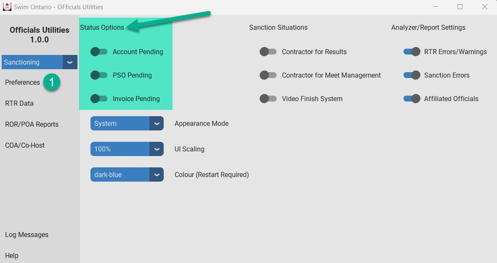
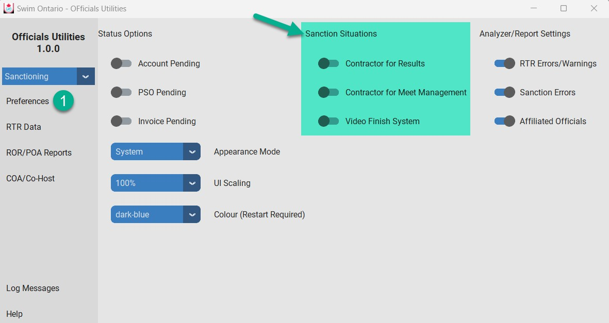
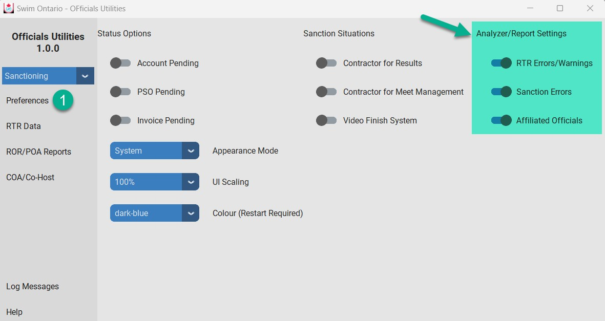
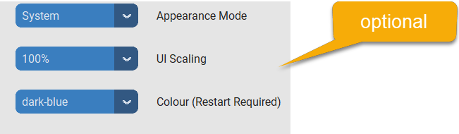

.. include:: common.rst
Preferences
===========

The Preferences menu allows you to customize both the Utilities Appearance on your screen but also your clubs hosting arrangements. There are three different sets of toggles

Status Options
--------------

 

•   Select which status (of registration) you want to use. The program automatically selects everyone as status Active. Reminder:
    o Invoice Pending status – the official has not yet been put on an invoice. The COA would need to generate an invoice to begin the registration process.
    o PSO Pending status – the club has not yet paid the generated invoice that this official is on.  The COA would need to arrange for payment by the club to Swim Ontario.
    o Account Pending – the club has started the registration and paid the invoice - the official has not yet completed their registration and consent forms.  The official needs to login and complete the steps.
    o Active – fully registered official

NOTE: Swim Ontario will select the following when determining Sanctioning Eligibility based on following criteria

•   Events prior to Nov. 30th

    o First club hosted meet: the Head Coach, Meet Manager(s) and Competition Coordinator(s) must be fully registered. Status option in the utility - Account Pending, PSO Pending, Invoice Pending
    o Second (or subsequent) hosted meet: Head Coach, meet manager(s), Competition Coordinator(s) and majority of returning officials must be fully registered (status active) for the season.  Status option in the utility – Active.

•   Events after Nov. 30th

    o First (and subsequent) hosted meet: Head Coach, meet manager(s), Competition Coordinator(s) and majority of returning officials must be fully registered (status active) for the season. Status option in the utility – Active.

Sanction Situation Options
--------------------------

Your club may use contractors to help run your meets. The utility takes this into account and makes the following changes in its algorithm

•   Contractor for results suppresses the club providing the CFJ/CJEs only if video finish is NOT enabled (i.e. RecTec Results management).
•   Contractor for Meet Manager (MM) will change any Certified MM requirement to Qualified MM. This would be for a contractor that is onsite as the designated Senior Meet Manager at the competition – not someone doing Entries Management only such as a coach or club admin staff.
•   Video Finish suppresses the CT requirement and adds 1 more qualified CFJ/CJE (i.e such as HSV atTPASC).

IMPORTANT NOTE: Contractors can be registered with a primary/home club, however, they are asked to NOT affiliate as officials with the clubs they will provide the services listed above. To be clear, they can register as officials and their certification will be recognized but are not to affiliate with other clubs in
the RTR.

Analyzer/Report Settings options
--------------------------------

Clubs can customize the details the report will provide through the Report Settings.  The default is that the toggles are enabled as these extra features in the report are highly recommended.

RTR Errors/Warnings will add any issues with officials missing information (i.e date for Level 1 certification).

Sanction Errors will provide basic information to reach the next level tier. They fall in three categories

•   Minimum available skills not met (not enough officials)
•   Unable to staff stroke & turn
•   Unable to staff senior grid

Affiliated Officials will run the report with affiliated officials with the club.  The club want to see where they land without the affiliated official(s).

Optional Utility Appearance
---------------------------

As a user you can select different “looks” for the utility to suit your preferences.

